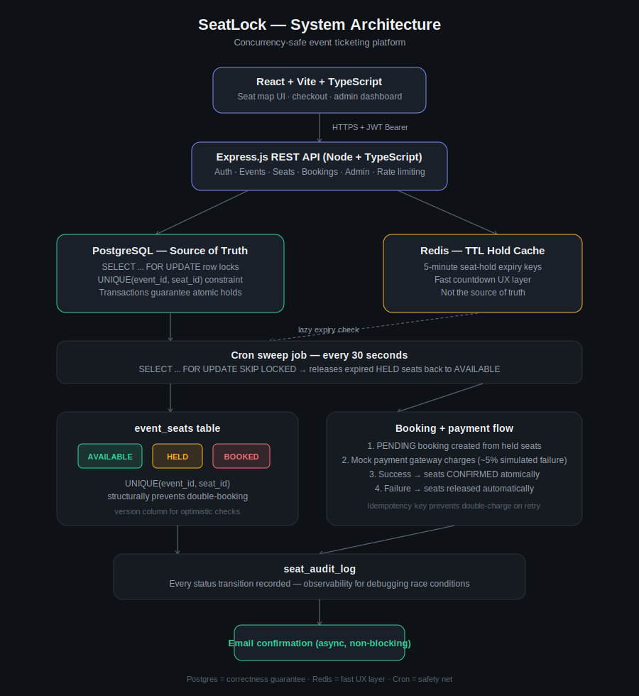
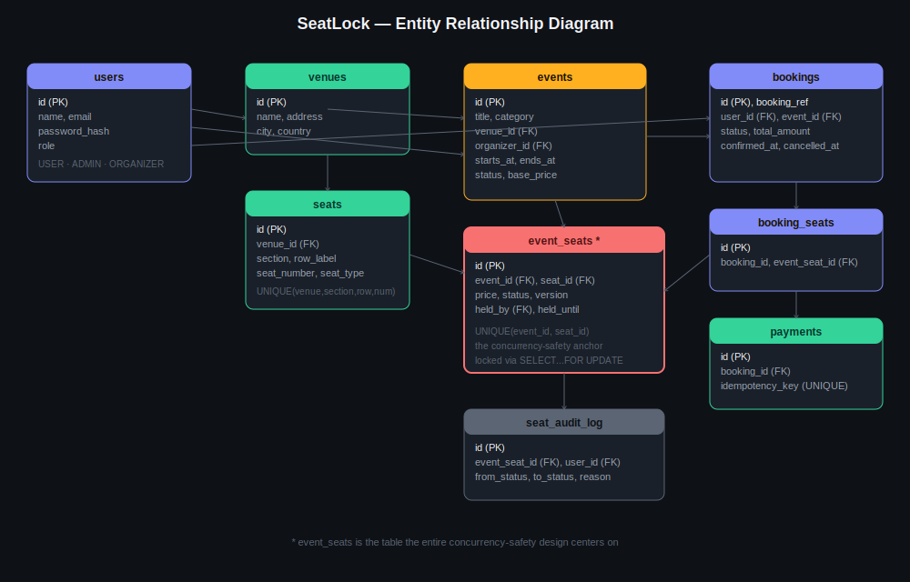

# 🎟️ SeatLock — Event Ticketing with Concurrency-Safe Seat Booking

> A full-stack ticketing platform where two people can never accidentally book the same seat — even if they click "Book" in the exact same millisecond.



---

## Table of Contents

1. [The Problem](#1-the-problem)
2. [Our Solution](#2-our-solution)
3. [Who Uses This](#3-who-uses-this)
4. [Tech Stack](#4-tech-stack)
5. [System Architecture & Scalability](#5-system-architecture--scalability)
6. [Cost & Future Scope](#6-cost--future-scope)
7. [Functional & Non-Functional Requirements](#7-functional--non-functional-requirements)
8. [Project Structure](#8-project-structure)
9. [Setup Instructions (Step by Step)](#9-setup-instructions-step-by-step)
10. [Demo Accounts](#10-demo-accounts)
11. [Proving the Concurrency Guarantee](#11-proving-the-concurrency-guarantee)
12. [API Reference](#12-api-reference)
13. [Resume & Portfolio Notes](#13-resume--portfolio-notes)

---

## 1. The Problem

Any system that sells a **limited, identifiable inventory** to many simultaneous users faces the same hard problem: **the race condition**.

Picture a popular concert. The moment tickets go live, hundreds of people hit "Book seat A12" within the same second. A naively-built system does roughly this:

```
1. Check if seat A12 is available  →  YES
2. Charge the customer's card
3. Mark seat A12 as booked
```

If two requests run steps 1–3 concurrently, **both** can see "available" at step 1 before either reaches step 3 — and now you've sold the same physical seat to two different people. This is not a hypothetical: it's a well-documented failure mode in real ticketing systems, and it causes real financial and reputational damage (chargebacks, refunds, furious customers, manual support escalations).

This class of problem — **correctly serializing access to a shared, finite resource under high concurrent load** — appears far beyond ticketing: flight/train seat booking, hotel room reservations, limited-stock flash sales, parking spot reservations, exam slot booking, and restaurant table reservations all share the exact same underlying problem.

## 2. Our Solution

SeatLock solves this with **two complementary concurrency-control layers**, each chosen because it's good at something the other isn't:

| Layer | Mechanism | What it guarantees |
|---|---|---|
| **PostgreSQL** | `SELECT ... FOR UPDATE` row-level locking inside ACID transactions, plus a `UNIQUE(event_id, seat_id)` constraint | **Correctness.** It is *structurally impossible* for two transactions to simultaneously hold/confirm the same seat — the second transaction blocks until the first commits or rolls back. This is the actual source of truth. |
| **Redis** | TTL key (`seat-hold:<id>`, 5-minute expiry) set alongside every Postgres hold | **Fast, cheap "soft hold" UX** — lets the frontend show a live countdown without expensive timestamp scans on every page load. If Redis goes down, Postgres still enforces correctness; we just temporarily lose the nice countdown. |
| **Cron sweep job** | Runs every 30s, uses `SELECT ... FOR UPDATE SKIP LOCKED` | **Safety net.** Catches any seat stuck in `HELD` whose hold expired — even if Redis missed an event or the app crashed mid-checkout. |

We deliberately **never trust Redis as the only source of truth for money-related state** — a classic distributed-systems mistake. Postgres transactions are the real guarantee; Redis is a performance/UX optimization layered on top.

The full seat lifecycle:

```
AVAILABLE  →  HELD (5 min, user-scoped)  →  BOOKED
    ↑              │
    └──────────────┘
   (release on: explicit cancel, payment failure, or hold expiry)
```

See `backend/src/services/seatLockService.ts` for the fully-commented implementation — this file is the heart of the project and the one to walk an interviewer through line by line.

## 3. Who Uses This

SeatLock's data model is intentionally **generic** — an `event` has a `venue`, a seat layout, and a time slot. This isn't hardcoded to concerts. The same engine works for:

| User type | What they do |
|---|---|
| **Guests / Customers** | Browse events without an account; register/log in; select seats on a live map; check out; view booking history; cancel bookings |
| **Organizers** | Create events (concerts, conferences, sports, theatre, travel...) with a custom seat layout (sections × rows × seat counts), set per-section pricing, cancel events |
| **Admins** | Everything organizers can do, plus a revenue/bookings dashboard, manual hold-sweep trigger, full system oversight |

Because the `category` field is just an enum (`CONCERT`, `SPORTS`, `CONFERENCE`, `TRAVEL`, `THEATRE`, `MOVIE`, `GENERAL`) and seat layouts are declarative, **the exact same codebase could power a movie theatre chain, a flight-seat-selector, or a conference registration system** with zero schema changes — only different seed data. This reusability is a deliberate design decision worth highlighting in interviews.

## 4. Tech Stack

| Layer | Choice | Why |
|---|---|---|
| Frontend | React 19 + TypeScript + Vite | Fast dev server, huge ecosystem, what most companies use day-to-day |
| Backend | Node.js + Express + TypeScript | Same language as the frontend (one mental model), huge job-market relevance |
| Database | PostgreSQL 16 | ACID transactions + row-level locking are exactly what concurrency-safety needs |
| Cache / Locks | Redis 7 | Industry-standard for TTL-based holds and fast ephemeral state |
| Auth | JWT (jsonwebtoken) + bcrypt | Stateless, simple, standard |
| Validation | Zod | Type-safe runtime validation, shared mental model with TypeScript |
| Testing | Jest + Supertest | Standard Node testing stack; includes a **real concurrency test** (see §11) |
| Dev environment | Docker Compose (Postgres + Redis only) | Zero manual DB installs — works identically on Windows/Mac/Linux |
| IDE | VS Code | As requested — every recommended extension is free |

**Everything in this stack is free and open-source.** No paid services are required to build, run, or demo this project end-to-end.

## 5. System Architecture & Scalability



### How this scales today (current design)
- **Stateless API servers**: the Express app holds no in-memory session state (auth is JWT-based), so you can run N instances behind a load balancer with zero sticky-session requirements.
- **Connection pooling**: the `pg` Pool (max 20 connections) prevents connection exhaustion under load.
- **Indexed hot paths**: `event_seats(event_id, status)`, `bookings(user_id)`, `bookings(event_id)` etc. are all indexed — seat-map reads and "my bookings" stay fast as data grows.
- **`FOR UPDATE SKIP LOCKED`** in the sweep job means the cleanup cron never blocks on rows actively being booked by real users — it just skips them this cycle and catches them next time.
- **Deterministic lock ordering**: when holding multiple seats at once, we sort seat IDs before locking, which prevents classic deadlocks where two transactions lock the same two rows in opposite order.

### How this would scale further (what I'd do next at higher load)
| Bottleneck at scale | Mitigation |
|---|---|
| Single Postgres instance becomes the write bottleneck | Read replicas for browse/search queries (which don't need locking); the *write* path (hold/confirm) stays on the primary since that's where correctness matters |
| Hot single-row contention (e.g. one viral event, thousands hitting the same few seats) | Redis-based **distributed semaphore/queue** in front of Postgres for that specific event — admit requests in order rather than having thousands of transactions queue on the same DB row |
| API server CPU/throughput | Horizontal scaling — stateless servers behind a load balancer (nginx / AWS ALB), trivial since there's no server-side session state |
| Search/browse latency at scale | Move to Elasticsearch/OpenSearch for the event catalog, keep Postgres for transactional seat data |
| Global users | CDN for the frontend static build (Vercel/Netlify/CloudFront); regional read replicas |

This is a deliberately **"start simple, scale the bottleneck you actually hit"** design — a strong interview answer is explaining *why* you didn't over-engineer this for scale you don't have yet, while being able to articulate exactly what you'd change and when.

## 6. Cost & Future Scope

**Cost to build and run today: $0.**
- Postgres + Redis: Docker containers (free) or free tiers of Supabase/Neon (Postgres) + Upstash (Redis) for cloud demo hosting
- Frontend hosting: Vercel/Netlify free tier
- Backend hosting: Render/Railway free tier
- No paid AI models or APIs required — this is a self-contained CRUD + concurrency system

**Future scope** (good talking points for "what would you add next"):
- Real payment gateway integration (Stripe) — the mock gateway's interface (`amount`, `idempotencyKey` → `success/failure`) is deliberately shaped to drop in a real provider with no changes to booking logic
- WebSocket-based live seat map (instead of 5-second polling) so users see others' selections instantly
- Waitlist system for sold-out events
- Dynamic pricing based on demand
- Multi-currency support
- SMS notifications alongside email
- Refund/partial-cancellation workflows
- Seat recommendation engine ("seats like this one")

## 7. Functional & Non-Functional Requirements

### Functional Requirements
- FR1: Users can register, log in, and receive a JWT for authenticated requests
- FR2: Anyone (including guests) can browse/search/filter published events
- FR3: Authenticated users can view a live seat map and select seats
- FR4: Selecting seats places a time-limited hold (no other user can select the same seat while held)
- FR5: Users can complete checkout (mock payment) to convert a hold into a confirmed booking
- FR6: Failed payments automatically release the held seats
- FR7: Users can view booking history and cancel upcoming bookings
- FR8: Organizers can create events with a custom seat layout and per-section pricing
- FR9: Organizers can cancel their own events
- FR10: Admins can view aggregate revenue/booking/seat-utilization statistics
- FR11: Expired holds are automatically released without manual intervention

### Non-Functional Requirements
- NFR1 (**Consistency**): Under no circumstance can two confirmed bookings reference the same seat for the same event (enforced at the DB constraint level, not just application logic)
- NFR2 (**Availability**): A failed payment or crashed request must never permanently lock a seat — the sweep job guarantees eventual recovery
- NFR3 (**Performance**): Seat-map reads should return in well under 200ms for a venue of a few hundred seats (achieved via indexing)
- NFR4 (**Security**): Passwords are bcrypt-hashed; all mutating endpoints require JWT auth; role-based authorization restricts organizer/admin actions
- NFR5 (**Idempotency**): Retried checkout requests (double-click, network retry) must never double-charge or double-confirm a booking
- NFR6 (**Observability**): Every seat state transition is recorded in an audit log for debugging and traceability
- NFR7 (**Usability**): Users always see *why* an action failed (e.g. "seat no longer available") rather than a generic error
- NFR8 (**Portability**): The entire stack runs identically on Windows, macOS, and Linux via Docker — no platform-specific setup

## 8. Project Structure

```
seatlock/
├── backend/
│   ├── src/
│   │   ├── config/          # DB + Redis connection setup
│   │   ├── controllers/     # Request handlers
│   │   ├── db/
│   │   │   ├── migrations/  # Versioned schema migrations
│   │   │   └── seeds/       # Demo data seed script
│   │   ├── jobs/            # Cron: expired-hold sweep
│   │   ├── middleware/      # Auth, error handling
│   │   ├── routes/          # Express route definitions
│   │   ├── services/        # Business logic (seatLockService is the core!)
│   │   ├── types/           # Shared TypeScript types
│   │   ├── utils/           # Validators, error classes
│   │   ├── app.ts           # Express app assembly
│   │   └── server.ts        # Entry point
│   └── package.json
├── frontend/
│   ├── src/
│   │   ├── api/              # Axios client + typed endpoint functions
│   │   ├── components/       # SeatMap, Navbar, ProtectedRoute, etc.
│   │   ├── context/          # AuthContext
│   │   ├── hooks/            # useCountdown
│   │   ├── pages/            # One file per route
│   │   ├── styles/           # Design tokens (global.css)
│   │   └── types/            # Shared TypeScript types
│   └── package.json
├── docs/
│   └── diagrams/             # Architecture + ERD SVGs
├── docker-compose.yml         # Postgres + Redis, one command
└── package.json               # Root scripts to run everything together
```

## 9. Setup Instructions (Step by Step)

### Prerequisites (all free)
- Node.js 20+ (LTS) — https://nodejs.org
- Docker Desktop (for Postgres + Redis — no manual DB install needed) — https://www.docker.com/products/docker-desktop/
- VS Code (you already have this) — https://code.visualstudio.com/
- Git — https://git-scm.com/

### Step 1 — Clone and install
```bash
git clone <your-repo-url> seatlock
cd seatlock
npm run install:all
```
This installs dependencies for both `backend/` and `frontend/`.

### Step 2 — Start Postgres + Redis with Docker
```bash
npm run docker:up
```
This starts two containers (Postgres on `5432`, Redis on `6379`) with persistent volumes. Verify they're healthy:
```bash
docker compose ps
```
> **No Docker?** You can instead install Postgres 16 and Redis locally and update the connection strings in `backend/.env` — but Docker is strongly recommended since it requires zero configuration.

### Step 3 — Configure environment variables
```bash
cp backend/.env.example backend/.env
cp frontend/.env.example frontend/.env
```
The defaults in `.env.example` already match the Docker Compose credentials, so **no editing is required** to get started. (Do change `JWT_SECRET` before any real deployment.)

### Step 4 — Run database migrations
```bash
npm run migrate
```
This creates all tables (`users`, `venues`, `events`, `seats`, `event_seats`, `bookings`, `booking_seats`, `payments`, `seat_audit_log`).

### Step 5 — Seed demo data
```bash
npm run seed
```
This creates 3 demo accounts (admin/organizer/user) and 3 demo events (concert, conference, sports) with full seat maps, ready to browse and book immediately.

### Step 6 — Run the app
```bash
npm run dev
```
This starts **both** the backend (`http://localhost:4000`) and frontend (`http://localhost:5173`) concurrently with hot-reload, using `concurrently`.

Open **http://localhost:5173** in your browser. 🎉

### Step 7 — Open in VS Code
```bash
code .
```
On first open, VS Code will prompt you to install the recommended extensions (ESLint, Prettier, Docker, PostgreSQL client, Thunder Client for API testing) — accept this, all are free.

### Running things individually (optional)
```bash
npm run dev:backend     # backend only, with hot reload
npm run dev:frontend    # frontend only, with hot reload
npm run test:backend    # run the Jest test suite (includes the concurrency test!)
npm run docker:logs     # tail Postgres/Redis container logs
npm run docker:down     # stop the containers
```

### One-command setup (alternative to steps 1–5)
```bash
npm run setup
```
Runs install → docker up → migrate → seed in sequence.

---

## 10. Demo Accounts

All seeded accounts use the password `Password123!`

| Role | Email | Capabilities |
|---|---|---|
| Admin | `admin@seatlock.app` | Everything + `/admin` dashboard |
| Organizer | `organizer@seatlock.app` | Create/cancel events |
| Customer | `user@seatlock.app` | Browse, book, manage own bookings |

## 11. Proving the Concurrency Guarantee

This is the single most important thing to demo in an interview. Run:

```bash
npm run test:backend
```

This executes `seatLockService.concurrency.test.ts`, which:

1. Creates one event with exactly **one seat**
2. Creates **20 separate users**
3. Fires **all 20 "hold this seat" requests simultaneously** with `Promise.allSettled`
4. Asserts that **exactly 1 succeeds and 19 are rejected** with a `SeatUnavailableError`
5. Verifies the final database state matches (seat is `HELD` by exactly the one winner)

This was run against a real PostgreSQL instance during development — 20 concurrent requests in, exactly 1 winner out, every time. That's the proof point: it's not a claim, it's a passing test you can re-run live in an interview.

```
PASS src/services/seatLockService.concurrency.test.ts
  Concurrency-safe seat holding
    ✓ allows exactly one of N concurrent hold requests to succeed for the same seat
```

## 12. API Reference

Base URL: `http://localhost:4000/api`

| Method | Endpoint | Auth | Description |
|---|---|---|---|
| POST | `/auth/register` | — | Create account |
| POST | `/auth/login` | — | Get JWT |
| GET | `/auth/me` | required | Current user info |
| GET | `/events` | — | Browse/filter events |
| GET | `/events/:id` | — | Event detail + live seat map |
| POST | `/events` | Organizer/Admin | Create event + seat layout |
| PATCH | `/events/:id/cancel` | Organizer/Admin | Cancel event |
| POST | `/seats/hold` | required | Hold seats (the core endpoint!) |
| POST | `/seats/release` | required | Release held seats |
| POST | `/bookings` | required | Create pending booking from held seats |
| POST | `/bookings/:id/checkout` | required | Pay + confirm booking |
| POST | `/bookings/:id/cancel` | required | Cancel booking, release seats |
| GET | `/bookings/my` | required | Booking history |
| GET | `/bookings/:id` | required | Booking detail |
| GET | `/venues` | — | List venues |
| POST | `/venues` | Organizer/Admin | Create venue |
| GET | `/admin/stats` | Admin | Revenue/booking dashboard data |
| GET | `/health` | — | Postgres/Redis health check |

Full request/response shapes are documented via Zod schemas in `backend/src/utils/validators.ts`.

## 13. Resume & Portfolio Notes

**Suggested resume bullet points:**
> Built SeatLock, a full-stack event ticketing platform (React/TypeScript, Node/Express, PostgreSQL, Redis) implementing concurrency-safe seat booking via database row-level locking and Redis TTL holds; verified correctness with a concurrent-load test proving exactly one winner among 20 simultaneous requests for the same seat.

> Designed a generic, reusable seat-inventory data model supporting any seated-event type (concerts, conferences, sports, travel) with declarative seat-layout generation, role-based access control, and an idempotent checkout flow preventing duplicate charges on retry.

**Suggested GitHub topics/tags:** `nodejs` `typescript` `react` `postgresql` `redis` `concurrency` `system-design` `full-stack` `express` `vite`

**What to screenshot for your portfolio:**
1. The architecture diagram (`docs/diagrams/architecture.svg`)
2. The seat map UI mid-selection (amber held seats, grey booked seats)
3. The passing concurrency test in your terminal
4. The admin dashboard

**Likely interview questions this project prepares you for:**
- "Tell me about a time you handled a race condition" → walk through `seatLockService.ts`
- "How would you prevent double-booking in a ticketing system?" → the two-layer answer in §2
- "How would you scale this to 1M users?" → §5
- "What's the difference between optimistic and pessimistic locking, and which did you use?" → pessimistic (`FOR UPDATE`), explain why correctness mattered more than throughput here, and mention the `version` column as an optimistic-locking artifact included but not relied on as primary
- "How do you prevent double-charging on a retried payment?" → idempotency key in `bookingService.ts`
